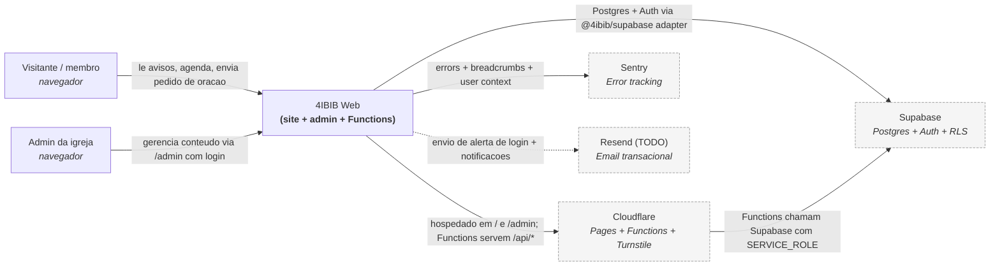
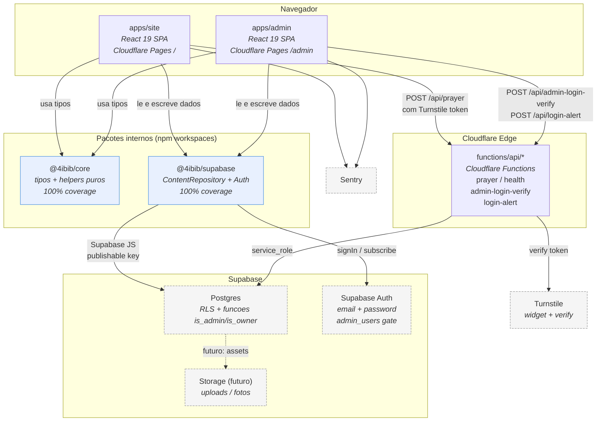

# Arquitetura — Diagrama C4

Este documento descreve a arquitetura do **4IBIB Web** seguindo o modelo
[C4](https://c4model.com/): tres niveis (Context, Container, Component)
em ordem crescente de detalhe. Os diagramas usam Mermaid e renderizam direto
no GitHub.

Atualizado em 2026-05-04.

---

## Nivel 1 — Context

Mostra os principais atores humanos e sistemas externos que interagem com o
**4IBIB Web**. O sistema serve dois publicos: visitantes/membros (site
publico) e administradores da igreja (painel `/admin`). Tudo persiste em
**Supabase** (Postgres + Auth + RLS); a hospedagem e proxy fica na
**Cloudflare** (Pages + Functions + Turnstile); erros vao para o
**Sentry**; o canal de email transacional (Resend) e um plano futuro.

**Notas:**

- O fluxo de oracao e protegido por **Cloudflare Turnstile** (widget no
  cliente + verificacao server-side em `functions/api/prayer.js`).
- A `service_role` da Supabase **nunca** vai para o frontend; so as
  Functions (rodam em Cloudflare) e codigo CI usam essa chave.
- O canal Resend ainda nao esta plugado: a Function
  `functions/api/login-alert.js` apenas registra o evento por enquanto.

---

## Nivel 2 — Container

Detalha os "containers" deployaveis do sistema 4IBIB Web. Tudo dentro de uma
unica organizacao monorepo (`npm workspaces`). As duas SPAs (`apps/site` e
`apps/admin`) consomem **somente** os pacotes internos `@4ibib/core`
(tipos puros) e `@4ibib/supabase` (adapter). Detalhes do Supabase nunca
vazam para a UI.

**Notas:**

- O artefato final entregue ao Cloudflare Pages e gerado por
  `scripts/compose-dist.mjs`, que compoe os dois `dist/` em um so com
  `apps/admin` montado em `/admin/`.
- `@4ibib/core` nao depende de Supabase nem de React: e codigo puro
  (helpers de data, formatacao, schemas Zod compartilhaveis).
- `@4ibib/supabase` exporta um `ContentRepository` segregado em 10
  sub-interfaces (Announcement, Schedule, Volunteer, Prayer, Profile,
  Ministry, RecurringMeeting, Admin, Audit, Snapshot).

---

## Nivel 3 — Component (apps/admin)

Detalha o painel admin (`apps/admin`), o container mais complexo do
projeto. A organizacao segue tres camadas: **shell** (providers + layout),
**views** (uma por tela) e **primitivas** (componentes reutilizaveis +
hooks + lib). React Query gerencia cache; cada view consome o adapter via
hooks centralizados em `hooks.ts`.

```mermaid
graph TB
    subgraph Shell["Shell (main.tsx)"]
        Root["App + createRoot"]
        EB["ErrorBoundary"]
        QC["QueryClientProvider"]
        TP["ToastProvider"]
        CP["ConfirmProvider"]
        Mon["initMonitoring (Sentry)"]
    end

    subgraph Views["Views (lazy-loaded)"]
        Dash["DashboardView"]
        Annc["AnnouncementsView"]
        Sched["ScheduleView"]
        Annual["AnnualScheduleView"]
        Members["MembersView"]
        House["HouseholdsView"]
        Prayers["PrayersView"]
        Min["MinistriesView"]
        Audit["AuditLogView"]
        Profile["ProfileView"]
        Team["TeamView"]
    end

    subgraph Primitives["Primitivas (components/)"]
        ListView["ListView"]
        Form["Form + FieldGroup"]
        Modal["Modal"]
        Toast["Toast"]
        Confirm["ConfirmDialog"]
        Sk["Skeleton + EmptyState"]
        Sticky["StickyActionBar"]
        Topbar["MobileTopbar"]
        Help["ShortcutsHelp"]
        CmdK["CommandPalette"]
        Turn["TurnstileWidget"]
    end

    subgraph Hooks["Hooks (hooks.ts)"]
        UMembers["useMembers"]
        UHouse["useHouseholds"]
        USnap["useSnapshot"]
        UArch["useArchive* / useRestore*"]
        UDup["useFindMemberDuplicates"]
        UToast["useToast"]
        UConfirm["useConfirm"]
    end

    subgraph Lib["Lib (lib/)"]
        Fmt["format.ts"]
        Lab["labels.ts"]
        LS["list-state.ts"]
        SO["sort-options.ts"]
        Sch["schemas.ts (zod)"]
        VT["view-transition.ts"]
        Lim["limits.ts"]
    end

    AdapterPkg["@4ibib/supabase"]
    CorePkg["@4ibib/core"]
    SentryFE["Sentry SDK"]

    Root --> EB
    EB --> QC
    QC --> TP
    TP --> CP
    CP --> Views

    Views --> Primitives
    Views --> Hooks
    Views --> Lib

    Hooks -->|fetch / mutate| AdapterPkg
    Hooks --> CorePkg
    Lib --> CorePkg

    Mon --> SentryFE
    Primitives --> Lib

    classDef external fill:#f5f5f5,stroke:#999,stroke-dasharray: 4 2
    classDef shell fill:#fff4d6,stroke:#d4a017
    class AdapterPkg,CorePkg,SentryFE external
    class Root,EB,QC,TP,CP,Mon shell
```

**Notas:**

- Cada view e carregada via `React.lazy` para code-splitting; um
  `ViewBoundary` separado isola crashes por tela.
- Mutations passam por `useArchive*` / `useRestore*` que conversam com as
  RPCs `archive_X` / `restore_X` no Postgres (soft-delete + audit log).
- `view-transition.ts` envolve `setView` em `document.startViewTransition`
  quando disponivel, com fallback direto e respeito a
  `prefers-reduced-motion`.
- `CommandPalette` (Ctrl+K) e `ShortcutsHelp` (Shift+?) sao montados no
  shell e disparam `navigateTo` para qualquer view.
